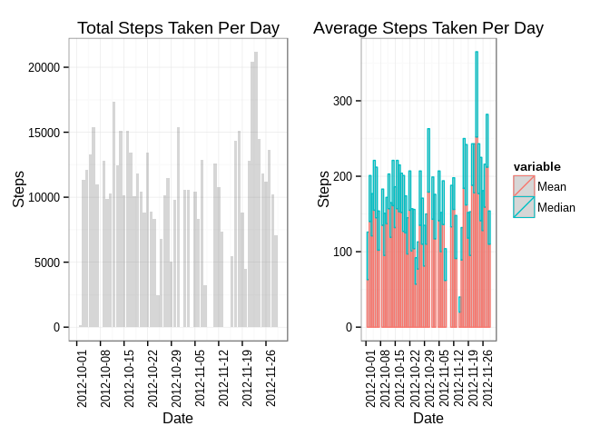
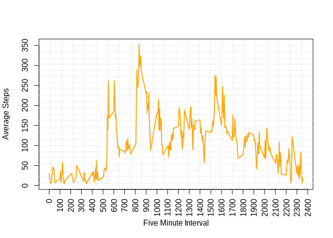
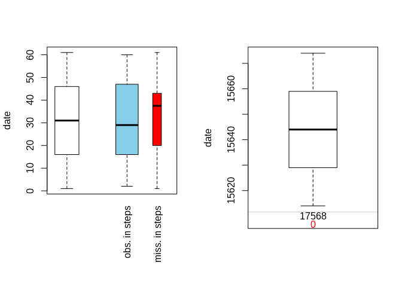
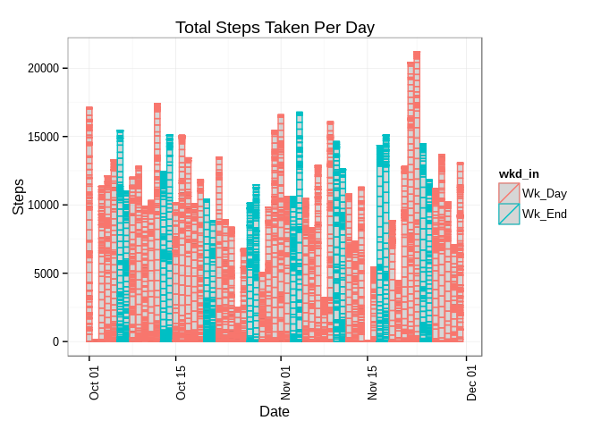
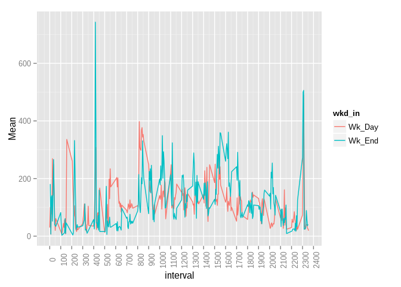

# Reproducible Research: Peer Assessment 1
Roberto Rivera  
04/26/2015  
\fontsize{9}{10}

## Loading and preprocessing the data

This section involves:  

 - downloading, unzipping and mapping the data  
 
 - creating a date-time field and   
 
 - creating a couple of aggregated data sets.  


```r
# The variables included in this dataset are:
# * steps: Number of steps taking in a 5-minute interval (missing values are coded as NA)
# * date: The date on which the measurement was taken in YYYY-MM-DD format
# * interval: Identifier for the 5-minute interval in which measurement was taken
# The dataset is stored in a comma-separated-value (CSV) file and there are a total of 
# 17,568 observations in this dataset.
fileUrl <- "https://d396qusza40orc.cloudfront.net/repdata%2Fdata%2Factivity.zip"
zipFile = "./activity.zip"
download.file(fileUrl, destfile = zipFile, method = "curl")

# check file
dateDownloaded <- date(); dateDownloaded
```

```
## [1] "Sun May 17 16:06:35 2015"
```

```r
unzip(zipFile, exdir="./")
```


```r
library(reshape2)
library(dplyr)
```

```
## 
## Attaching package: 'dplyr'
## 
## The following object is masked from 'package:stats':
## 
##     filter
## 
## The following objects are masked from 'package:base':
## 
##     intersect, setdiff, setequal, union
```

```r
library(pander)
library(stringr)

# read activity data
dat.a <- read.csv("activity.csv")
# add date time fields
dat.a$dttime <- str_pad(dat.a$interval, 4, pad = "0")
dat.a$dttime <- as.POSIXct(str_c(dat.a$date, " ", dat.a$dttime), format = "%Y-%m-%d %H%M")

# create date summary
dat.summ <- dat.a[,c(1:2)] %>%
    filter(steps > 0) %>%
    arrange(date, steps) %>%
    group_by(date) %>% 
    summarise(Total=as.numeric(sum(steps)), 
              Mean=round(mean(steps),0), 
              Median=round(median(steps),0)) %>%
    data.frame()
dat.summ$date <- as.Date(dat.summ$date)

# create date average summary
dat.avg <- dat.summ %>%
    melt(id="date") %>%
    filter(variable %in% c("Mean","Median"))

# create interval summary
dat.intv <- dat.a[,c(1,3)] %>%
    filter(steps > 0) %>%
    arrange(interval, steps) %>%
    group_by(interval) %>% 
    summarise(Total=as.numeric(sum(steps)), 
              Mean=round(mean(steps),0), 
              Median=round(median(steps),0)) %>%
    data.frame()
```

## What is mean total number of steps taken per day?

My calculations account for intervals having more than zero steps. See the results in the plots below. 


```r
library(ggplot2)
library(gridExtra)
```

```
## Loading required package: grid
```

```r
grid.arrange(
    ggplot(dat.summ, aes(date)) + #facet_grid(. ~ variable) + 
        geom_histogram(stat="identity", alpha=0.2, aes(y=Total)) +
        ylab("Steps") + xlab("Date") + theme_bw() + 
        theme(axis.text.x=element_text(angle=90)) +
        scale_x_date(breaks = "1 week") +
        ggtitle("Total Steps Taken Per Day"),
    ggplot(dat.avg, aes(x=date, y=value, color=variable)) + #facet_grid(. ~ variable) + 
        geom_histogram(stat="identity", alpha=0.2, aes(y=value)) +
        ylab("Steps") + xlab("Date") + theme_bw() + 
        theme(axis.text.x=element_text(angle=90)) +
        scale_x_date(breaks = "1 week") +
        ggtitle("Average Steps Taken Per Day"),
    ncol=2)
```

 

## What is the average daily activity pattern?

On average the maximum number of steps occur around 8:30am.


```r
plot(dat.intv$interval, dat.intv$Mean, type="l", xaxt="n",
     xlab= "Five Minute Interval", ylab= "Average Steps", col="orange" , lwd=2)
axis(1, xaxp=c(0, 2400, 24), las=3)
grid(nx=24)
```

 

## Imputing missing values

***There are 2,304 missing step values across the data set.***


```r
library(VIM);
```

```
## Loading required package: colorspace
## Loading required package: data.table
## 
## Attaching package: 'data.table'
## 
## The following objects are masked from 'package:dplyr':
## 
##     between, last
## 
## VIM is ready to use. 
##  Since version 4.0.0 the GUI is in its own package VIMGUI.
## 
##           Please use the package to use the new (and old) GUI.
## 
## Suggestions and bug-reports can be submitted at: https://github.com/alexkowa/VIM/issues
## 
## Attaching package: 'VIM'
## 
## The following object is masked from 'package:datasets':
## 
##     sleep
```

```r
panderOptions('table.split.table', Inf)
pander(md.pattern(dat.a))         # identify missig data pattern
```

Quitting from lines 119-122 (PA1_template.Rmd) 
Error in pander(md.pattern(dat.a)) : could not find function "md.pattern"
Calls: <Anonymous> ... withCallingHandlers -> withVisible -> eval -> eval -> pander

***To impute the missing step values, I used the MICE (Multivariate Imputation by Chained Equations) package. This method seemed to be rather straightforward and clear.***


```r
library(mice)
```

```
## Loading required package: Rcpp
## Loading required package: lattice
## mice 2.22 2014-06-10
```

```r
dat.imp <- mice(dat.a)            # generate imputed data sets
```

```
## 
##  iter imp variable
##   1   1  steps
##   1   2  steps
##   1   3  steps
##   1   4  steps
##   1   5  steps
##   2   1  steps
##   2   2  steps
##   2   3  steps
##   2   4  steps
##   2   5  steps
##   3   1  steps
##   3   2  steps
##   3   3  steps
##   3   4  steps
##   3   5  steps
##   4   1  steps
##   4   2  steps
##   4   3  steps
##   4   4  steps
##   4   5  steps
##   5   1  steps
##   5   2  steps
##   5   3  steps
##   5   4  steps
##   5   5  steps
```

```r
dat.imp <- complete(dat.imp)      # combine imputed data set
dat.imp$date   <- as.Date(dat.imp$date)
```

***These plots indicate how the step values look before and after imputation:***


```r
par(mfrow = c(1, 2));
pbox(dat.a, pos = 2)              # plot missing data
```

```
## Warning in createPlot(main, sub, xlab, ylab, labels, ca$at): not enough
## space to display frequencies
```

```r
pbox(dat.imp, pos = 2)
```

 

```r
par(mfrow = c(1, 1));
```

## Are there differences in activity patterns between weekdays and weekends?

When comparing the number of steps taken by weekend and weekday, there are a few interesting observations. The total number of steps appear to fluctuate more during weekdays.  In addition, the time of day when steps are taken vary by weekday or weekend.  You can see that more walking happens around 1am on the weekends for example.


```r
dat.imp$wk_day <- weekdays(dat.imp$date)
dat.imp$wkd_in <- as.factor(
    ifelse(dat.imp$wk_day %in% c("Saturday","Sunday"), "Wk_End", "Wk_Day"))

# create interval summary
dat.int2 <- dat.imp[,c(1,3,6)] %>%
    filter(steps > 0) %>%
    arrange(interval, steps) %>%
    group_by(interval, wkd_in) %>% 
    summarise(Total=as.numeric(sum(steps)), 
              Mean=round(mean(steps),0), 
              Median=round(median(steps),0)) %>%
    data.frame()

ggplot(dat.imp, aes(date, color=wkd_in)) + #facet_grid(. ~ wkd_in) + 
    geom_histogram(stat="identity", alpha=0.2, aes(y=steps)) +
    ylab("Steps") + xlab("Date") + theme_bw() + 
    theme(axis.text.x=element_text(angle=90)) +
    ggtitle("Total Steps Taken Per Day")
```

 

```r
ggplot(data = dat.int2, aes(x=interval, y=Mean)) + geom_line(aes(colour=wkd_in)) +
    theme(axis.text.x=element_text(angle=90)) +
    scale_x_continuous(breaks = c(seq(from = 0, to = 2400, by = 100)))
```

 


